# Mermaid Diagram Integration

## ✅ Completed

Successfully integrated Mermaid diagram rendering into the Canvas markdown editor!

## Features

### 1. Automatic Mermaid Detection
- Markdown code blocks with `mermaid` language tag are automatically rendered as diagrams
- Uses the existing `MermaidDiagram` component from the codebase
- Dark theme styling matches the canvas design

### 2. Supported Diagram Types

All Mermaid diagram types are supported:

#### Flowcharts
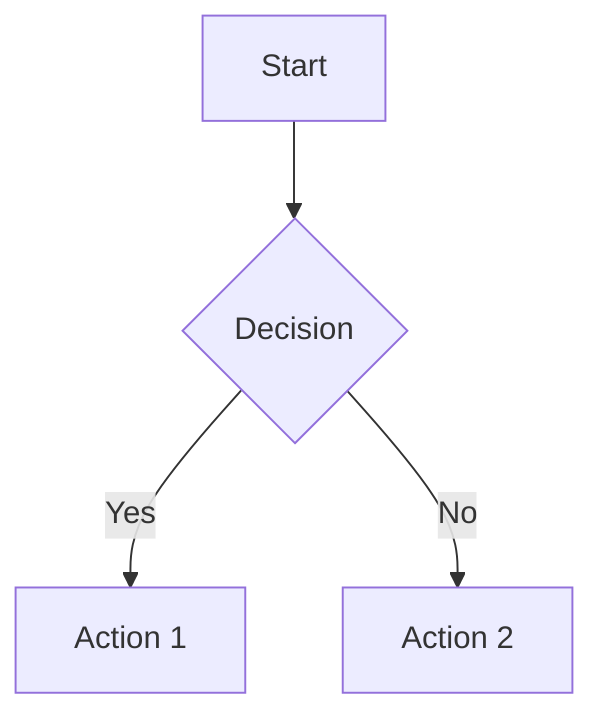

#### Sequence Diagrams
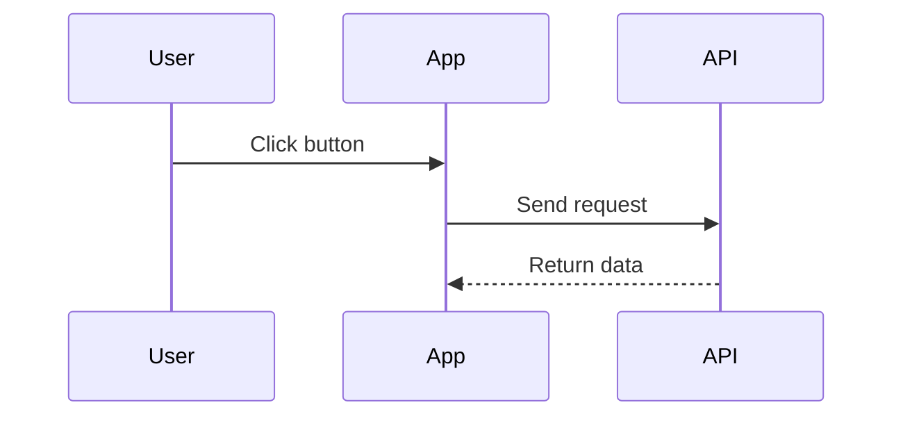

#### Gantt Charts
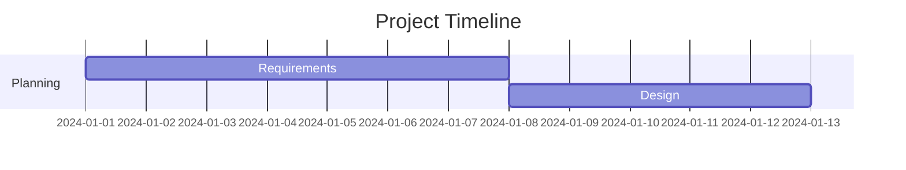

#### State Diagrams
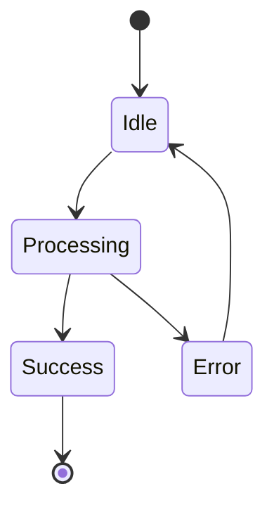

#### Class Diagrams
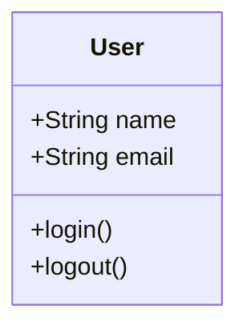

#### Entity Relationship Diagrams
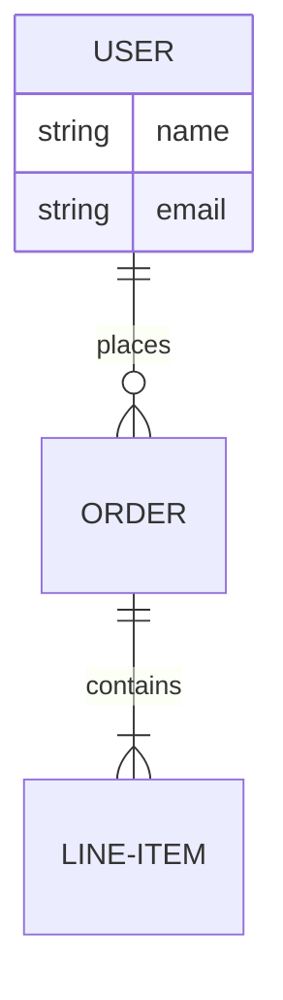

#### Pie Charts
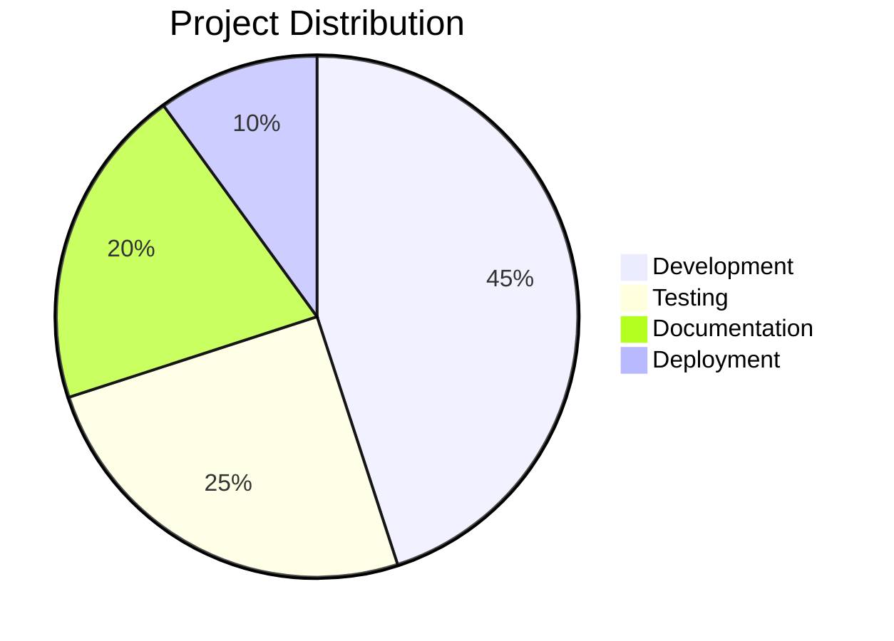

#### Journey Diagrams
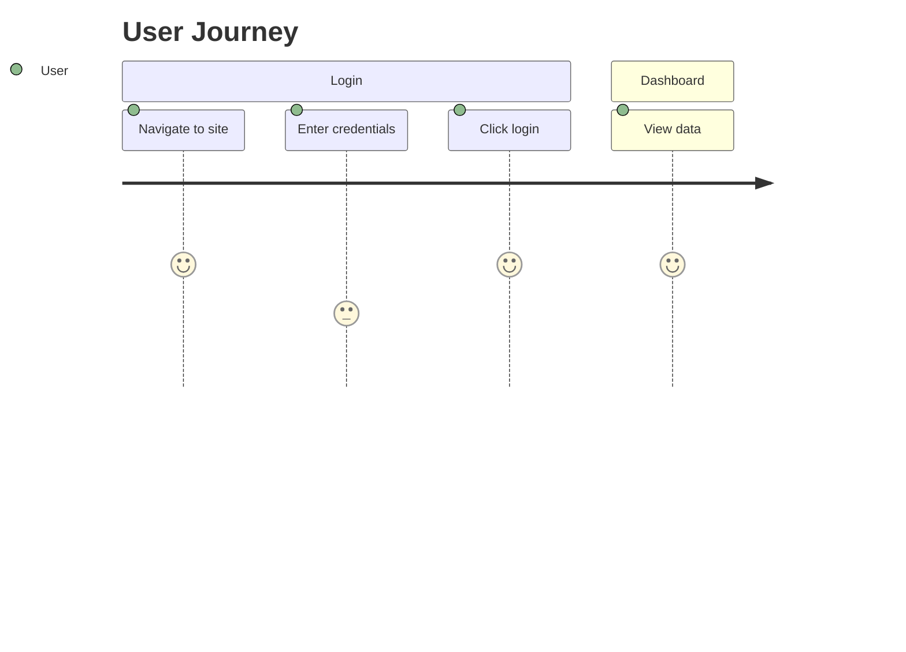

#### Mindmaps
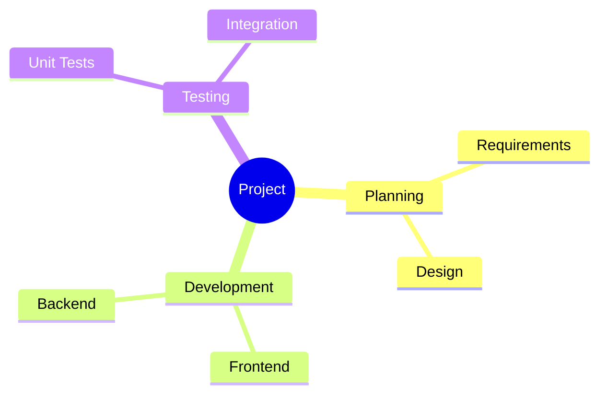

#### Timeline
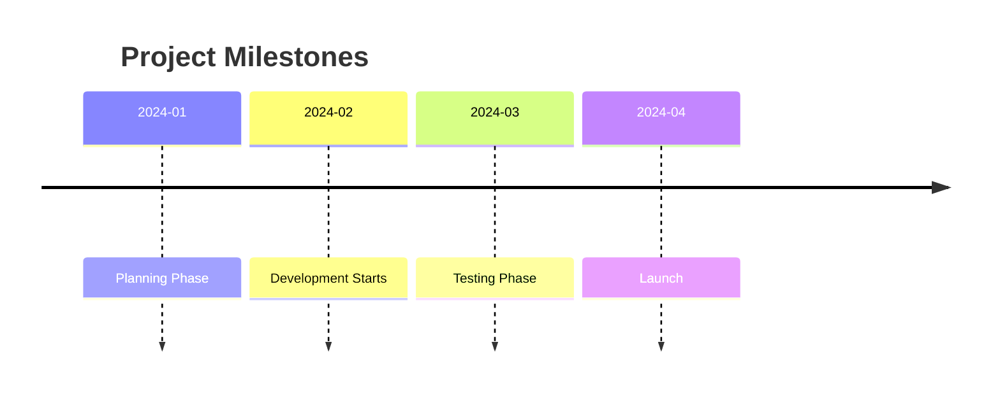

### 3. Interactive Features

The MermaidDiagram component includes:
- ✅ **Copy button** - Copy diagram source code
- ✅ **Download button** - Download as SVG
- ✅ **Fullscreen button** - View diagram in fullscreen
- ✅ **Dark theme** - Matches canvas styling
- ✅ **Responsive** - Adapts to container width

### 4. Real-time Preview

- Type Mermaid code in the editor
- See the rendered diagram instantly in Split or Preview mode
- Syntax errors are handled gracefully

## Usage

### In the Canvas Editor:

1. Open Canvas and switch to Markdown tab
2. Select Split or Preview mode
3. Type a code block with `mermaid` language:

````markdown
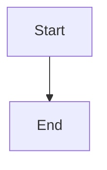
````

4. The diagram renders automatically in the preview panel!

### Example Markdown:

````markdown
# My Workflow

Here's the process flow:

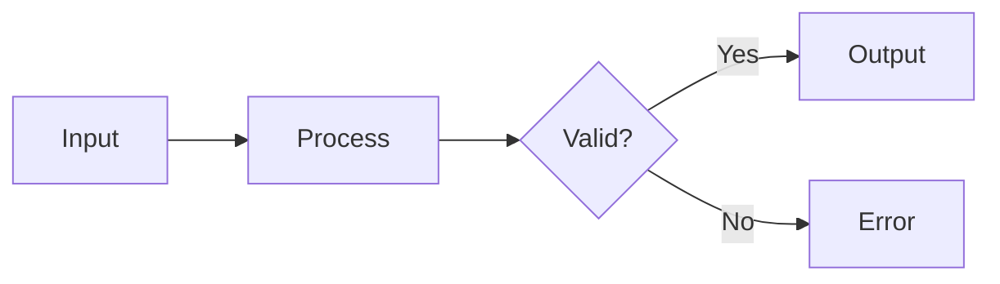

The diagram above shows the validation flow.
````

## Technical Implementation

### Files Modified

**packages/web/src/components/ChatBot/ChatBotCanvas.tsx**
- Added `MermaidDiagram` import
- Added custom `code` component to ReactMarkdown
- Detects `language-mermaid` class on code blocks
- Renders MermaidDiagram component for mermaid blocks
- Added Mermaid examples to default content
- Updated placeholder text to mention Mermaid support

### Code Structure

```typescript
<ReactMarkdown
  remarkPlugins={[remarkGfm]}
  rehypePlugins={[rehypeHighlight]}
  components={{
    code({ node, inline, className, children, ...props }) {
      const match = /language-(\w+)/.exec(className || '');
      const language = match ? match[1] : '';
      const codeContent = String(children).replace(/\n$/, '');

      // Handle Mermaid diagrams
      if (language === 'mermaid' && !inline) {
        return (
          <div className="my-6">
            <MermaidDiagram chart={codeContent} />
          </div>
        );
      }

      // Handle other code blocks...
    },
  }}
>
  {markdownContent}
</ReactMarkdown>
```

## Default Content

The canvas now opens with example content including:
- Welcome message
- Feature list
- Flowchart example
- Code block example
- Sequence diagram example
- Gantt chart example

This helps users understand the capabilities immediately!

## Benefits

1. **Visual Documentation** - Create flowcharts and diagrams directly in markdown
2. **No External Tools** - Everything integrated in the canvas
3. **Version Control Friendly** - Diagrams are text-based
4. **Professional Output** - High-quality SVG rendering
5. **Interactive** - Copy, download, and fullscreen capabilities

## Testing

To test Mermaid rendering:

1. Open Canvas (click Canvas button)
2. Switch to Markdown tab
3. Select Split mode
4. You'll see example diagrams already rendered
5. Try editing the Mermaid code to see live updates
6. Try different diagram types from the examples above

## Notes

- Mermaid syntax errors are handled gracefully
- Diagrams use dark theme matching the canvas
- All Mermaid diagram types are supported
- The MermaidDiagram component was already in the codebase
- No additional dependencies needed (mermaid already installed)

## Resources

- [Mermaid Documentation](https://mermaid.js.org/)
- [Mermaid Live Editor](https://mermaid.live/) - Test diagrams online
- [Mermaid Syntax Guide](https://mermaid.js.org/intro/syntax-reference.html)

## 🎉 Result

The Canvas markdown editor now supports professional diagram creation with Mermaid, making it a complete documentation and workflow design tool!

